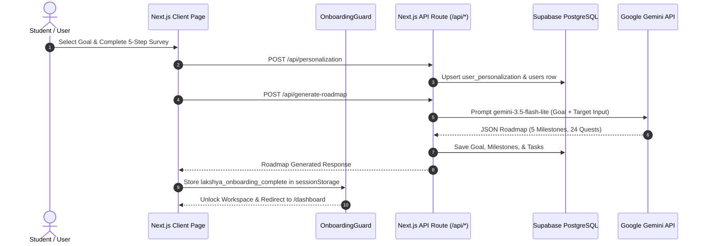

# 🏗️ Lakshya — Architecture Overview & System Design

This document details the high-level system architecture, data flow pipelines, database schemas, and component breakdown of **Lakshya**.

---

## 📐 High-Level Architecture Diagram

```
                             ┌───────────────────────────────┐
                             │       User Browser / Client   │
                             │  (Next.js App Router & React) │
                             └──────────────┬────────────────┘
                                            │
                                  HTTP / REST API Requests
                                            │
                                            ▼
                             ┌───────────────────────────────┐
                             │     Next.js Serverless Edge   │
                             │        (app/api/* Handlers)   │
                             └───────┬───────────────┬───────┘
                                     │               │
            Supabase DB / Auth SQL   │               │ Gemini AI Prompting
                                     ▼               ▼
                 ┌──────────────────────┐    ┌────────────────────────┐
                 │ Supabase PostgreSQL  │    │ Google Gemini API      │
                 │  - Auth Server       │    │ - gemini-3.5-flash-lite│
                 │  - RLS Security      │    │ - gemini-2.0-flash     │
                 │  - 11 Tables         │    └────────────────────────┘
                 └──────────────────────┘
```

---

## 🔄 Data Flow Architecture



---

## 🗄️ Database Schema Overview (Supabase PostgreSQL)

Lakshya uses **11 core database tables** in Supabase with foreign key constraints, indexes, and Row Level Security (RLS).

### Entity Relationship Diagram (Text Schema)

```
[users] (id PK, email, theme_name, theme_mode)
   │
   ├──< [goals] (id PK, user_id FK, type, title, description, target_date, is_active, progress)
   │       │
   │       └──< [milestones] (id PK, goal_id FK, title, description, status, order_index)
   │               │
   │               └──< [tasks] (id PK, user_id FK, goal_id FK, milestone_id FK, title, status, priority, estimated_hours, due_date)
   │                       │
   │                       └──< [events] (id PK, user_id FK, task_id FK, title, start_time, end_time, event_type)
   │
   ├──< [user_personalization] (id PK, user_id FK, current_level, weak_subjects, strong_subjects, daily_available_hours, exam_date, target_rank_score, stress_level)
   │
   ├──< [notes] (id PK, user_id FK, title, content, tags, is_favorite, created_at, updated_at)
   │
   ├──< [pomodoro_sessions] (id PK, user_id FK, duration_minutes, completed_at)
   │
   ├──< [timetable] (id PK, user_id FK, subject, day_of_week, start_time, end_time)
   │
   ├──< [user_streaks] (id PK, user_id FK, current_streak, longest_streak, last_activity_date)
   │
   └──< [analytics_events] (id PK, user_id FK, goal_id FK, event_type, metadata, timestamp)
```

---

## 🧩 Module Deep-Dives

### 1. Onboarding & Security Guard (`components/auth/onboarding-guard.tsx`)
- **Internal Operation**: Wrapped around protected App Router routes in `app/(auth)/layout.tsx`.
- **Client Route Interception**: Intercepts navigation attempts on non-exempt paths.
- **Session Caching**: Checks `/api/user/onboarding-status`. If complete, caches `lakshya_onboarding_complete = 'true'` in `sessionStorage` for instantaneous sub-millisecond client route transitions.

### 2. Gamified AI Island Roadmap (`app/(auth)/roadmap/page.tsx` & `components/roadmap/game-map.tsx`)
- **Game Map Rendering**: Renders milestones as sequential winding islands with dynamic water animations, seasonal themes, level badges, and unlock criteria.
- **Duolingo Unlock Rule**: Level $N$ unlocks only if Level $N-1$ is completed ($100\%$ task progress).
- **Boss Level**: The final milestone is marked as `isBoss`, displaying a dragon icon and unlocking a Level Reward Celebration Modal upon completion.

### 3. Saathi AI Companion (`app/api/ai/chat/route.ts` & `components/saathi/chatbot.tsx`)
- **Grounded Context Injection**: Queries Supabase DB for active goal, current streak, weak subjects, and pending tasks. Injects these facts into the system prompt.
- **Goal Validation Check**: Uses `gemini-3.5-flash-lite` to detect semantic mismatches between goal categories (e.g. UPSC vs Placement).
- **Event-Driven Drawer**: Listens to custom window event `open-saathi-chat` so clicking the Saathi AI banner on the dashboard smoothly triggers the chatbot drawer without page reloads or 404 errors.

### 4. Daily Planner (`app/(auth)/planner/page.tsx` & `components/planner/timeline-view.tsx`)
- **Schedule Presets**: Supports *Early Bird (6AM–10PM)*, *Regular (8AM–11PM)*, *Night Owl (10AM–2AM)*, and *Late Night (9AM–3AM)* with local persistence.
- **Task Distribution Engine**: Groups dated tasks on their specific due date and distributes undated tasks across future days (max 3 per day) to avoid overwhelming daily timelines.
- **Dynamic Load More**: "🚀 Load More Tasks" button allows motivated users to pull tomorrow's tasks into today's timeline on demand.

### 5. Task-Calendar Sync (`app/(auth)/tasks/page.tsx` & `app/api/events/route.ts`)
- **Calendar Event Generator**: Converts any task into a scheduled calendar event (`POST /api/events`) with automatic 9:00 AM start time fallback and estimated duration calculation.

### 6. Rich-Text Notes (`app/(auth)/notes/page.tsx`)
- **TipTap Rich Text**: Serializes note content as JSON or HTML strings.
- **Theme Variables**: Utilizes CSS Custom Properties (`var(--theme-background-alt)`, `var(--theme-text-primary)`) to ensure full legibility across all 5 workspace vibes and dark/light modes.

### 7. Analytics & Productivity Insights (`app/(auth)/analytics/analytics-client.tsx`)
- **Readiness Metric**: Calculates goal readiness based on task completion percentage and active goal title.
- **Recharts Integration**: Renders 14-day completion trend area chart, task distribution pie chart, and priority breakdown bar chart.

---

## 🔒 Security & Environment Configuration

- **Environment File Protection**: `.env.local` is strictly listed in `.gitignore` to prevent secret leaks.
- **Row Level Security (RLS)**: PostgreSQL policies enforce `WHERE user_id = auth.uid()` on all Supabase tables so users can only access their own data.
